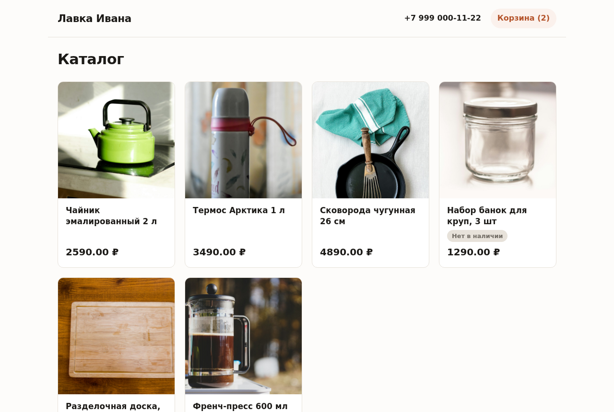
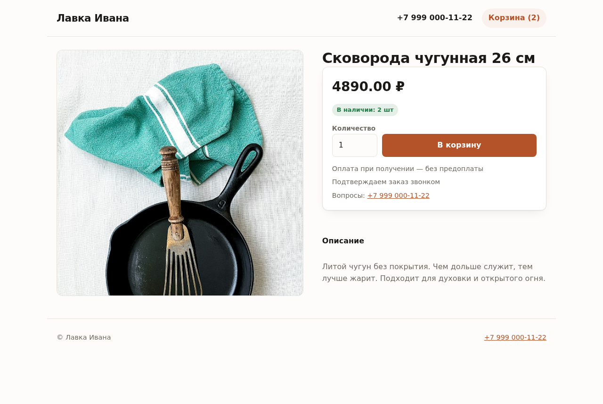
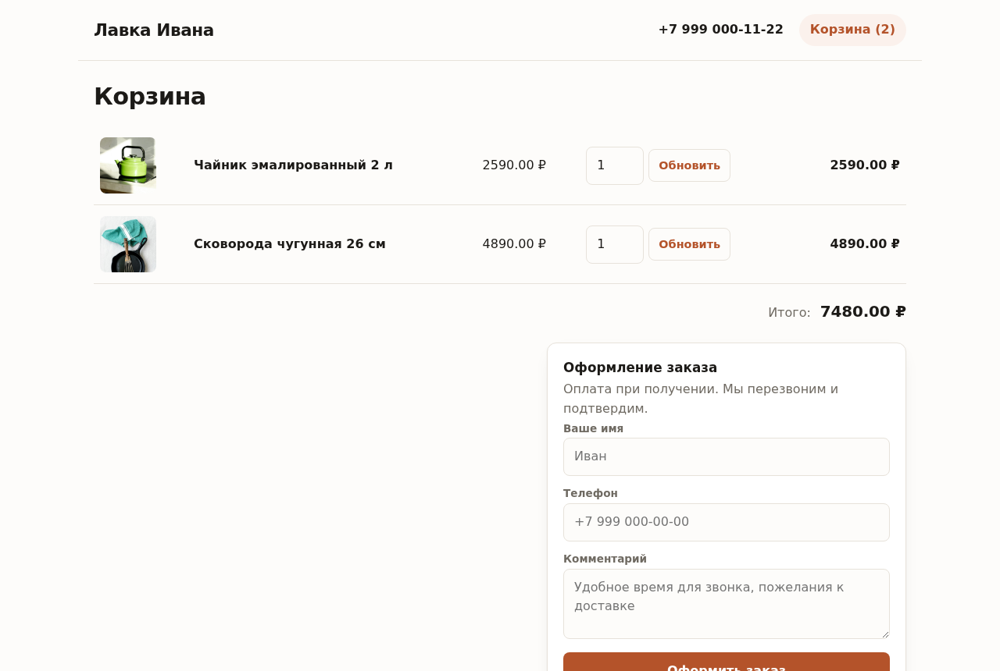
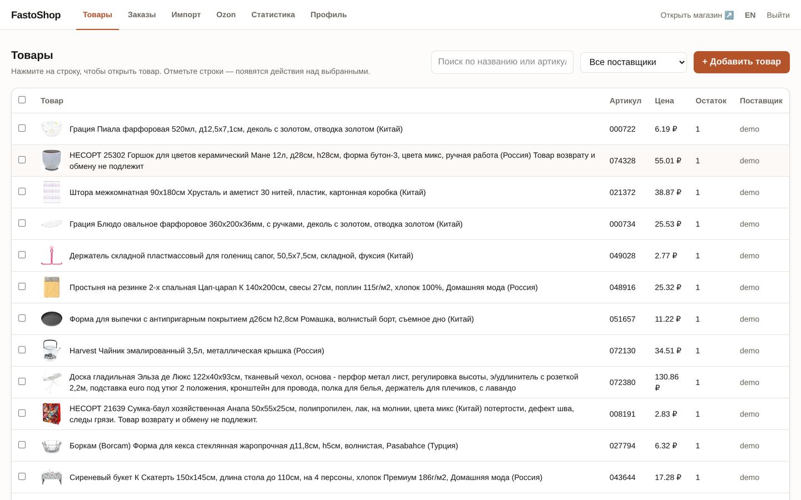
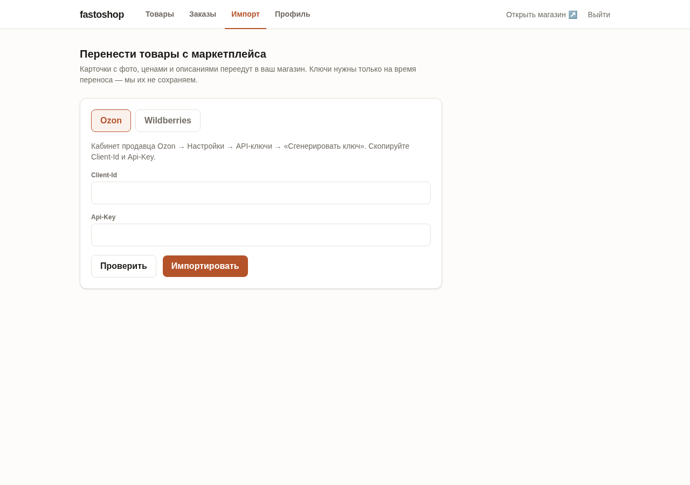
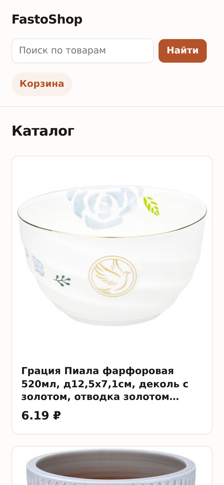
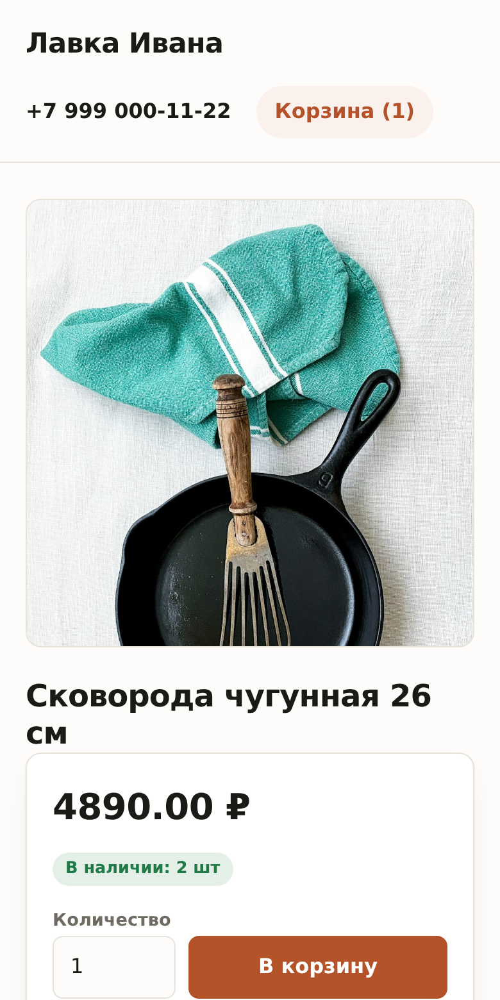
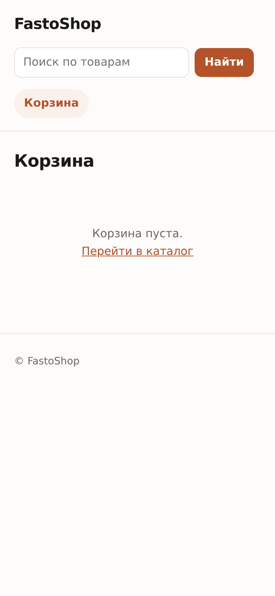

# FastoShop

[](https://github.com/fastogt/fastoshop/actions/workflows/ci.yml)
[](LICENSE)
[](https://go.dev)

**Второй канал продаж рядом с маркетплейсом: заказы из поиска, без комиссии, с контактом покупателя.**

FastoShop, self-hosted магазин для продавца, который уже торгует на WB, Ozon, Avito или Kufar. Площадку он не заменяет: там остаётся всё как было. Рядом появляется канал, про который в гонке за маркетплейсами забыли, **поиск**. Люди по-прежнему ищут товар в Яндексе и Google, и в этом канале нет комиссии с продажи, а покупатель приходит к вам с именем и телефоном, а не остаётся клиентом площадки.

По сути это кабинет продавца как на маркетплейсе, товары, заказы, остатки, только магазин работает на **вашем домене и вашем VPS**: за программу денег нет, комиссии с продаж нет, и нет чужой платформы, которая в любой момент поменяет правила.

> **Не хотите заниматься сервером?** [fastoshop.by](https://fastoshop.by), поставим и будем следить: домен, сертификат, бэкапы, обновления, поддержка и перенос каталога из любого прайса за 75 BYN (2 700 ₽) в месяц. Это наш платный хостинг; сам FastoShop был и остаётся бесплатным, ставьте на свой VPS и никому ничего не должны.

## Как это выглядит

| Витрина (то, что видят покупатели и поисковики) | Карточка товара |
|---|---|
|  |  |

| Корзина, несколько товаров одной заявкой, без единой строчки JavaScript | |
|---|---|
|  | |

| Товары в админке | Перенос каталога с Ozon/WB |
|---|---|
|  |  |

С телефона, половина покупателей приходит именно так:

<p>
  
  
  
</p>

## Два главных отличия

### 🚚 Каталог наполняется сам, а не забивается руками

У вас уже есть карточки на Wildberries, Ozon, Avito или Kufar, заводить их заново не нужно:

- **Импорт каталога из WB, Ozon, YML-выгрузки или своего CSV** — вставьте API-ключ из кабинета продавца или просто ссылку на стандартную выгрузку вашего сайта (Битрикс/InSales/Тильда), и карточки с фото, ценами и остатками переезжают в FastoShop. Фото подключаются по ссылкам из источника, поэтому импорт даже 20 000 товаров занимает секунды; когда захотите перестать зависеть от чужого сервера, «Заполнить → Забрать фото к себе» в Товарах скачает их на ваш диск, показывая прогресс.
- **Поставщик обновил прайс, видно, что изменилось** — загрузка идёт в группу поставщика («Ромашка», «Оптбаза»), и перед записью показывается дифф: что завезли, что сняли, где резко выросла цена. Группы не мешают друг другу: фид одного поставщика не тронет товары другого и заведённые вами вручную.
- **Двусторонняя синхронизация остатков с Ozon** — отметили товары, которые продаёте на площадке, и продажа где угодно уменьшает остаток везде: заказ на витрине за секунды уезжает в кабинет, продажа на Ozon списывает остаток магазина. На площадку едет только отмеченное, а цена там своя, процентом или лестницей наценки. Работаем по схеме **FBS** (товар на вашем складе): остатками управляет магазин. Товары на складе Ozon (FBO) не синхронизируются, их остаток знает только площадка. Без сторонних коннекторов и второй подписки.

- **Синхронизация с Wildberries** — то же самое для ВБ, со своими правилами площадки. Товары связываются с карточками по артикулу продавца, штрихкод и nmID читаются из самой карточки: в прайсе их нет и быть не должно. Остаток уходит по штрихкоду, цена по карточке, а ответ о ценах приходит задачей и позже, поэтому в админке видно состояние «в пути». Если у размеров одной карточки разные цены, мы не отправляем ничего и говорим об этом: ВБ принимает одну цену на карточку, и выбирать за владельца нельзя. Есть переключатель тестового контура, чтобы подключиться и проверить связку, ничего не задев.

Маркетплейс остаётся вашим каналом продаж, просто перестаёт быть единственным.

### 🔍 SEO как главный приоритет, а не галочка

Поиск, тот самый забытый канал, ради которого всё и затевается, поэтому витрина спроектирована под поисковики с первой строчки кода:

- **Server-rendered HTML, ноль JavaScript** на публичных страницах. Яндекс и Google получают готовую страницу, ничего не нужно исполнять. Мгновенный LCP.
- **JSON-LD `schema.org/Product`** на каждой карточке, цена и наличие прямо в сниппете поисковой выдачи.
- **Поиск по магазину без JavaScript** — строка в шапке витрины, результаты рендерит сервер, ищется и по названию, и по артикулу. Страницы результатов закрыты от индексации (`noindex,follow`), чтобы не разменивать краулинговый бюджет на бесконечные выдачи.
- **Страница под каждую категорию** — `/c/tekstil/spalnya/kpb-evro` со своим заголовком, описанием и хлебными крошками: запрос «купить КПБ евро оптом» ведёт на посадочную страницу, а не на общий каталог. Дерево приезжает из источника само, из YML-фида, таксономии Ozon, справочника предметов WB или ячейки прайса вида «Текстиль > Спальня». На каталоге «Петровского» это 570 посадочных страниц вместо одной.
- **Разделы, ваши**: вкладка «Категории» это дерево слева и форма справа, как в любой каталожной админке. Создать раздел (хоть пустой), переименовать, перенести под другого родителя, задать порядок, скрыть с витрины, удалить. Переименование уносит товары и всю ветку с собой, а старый адрес отдаёт 301, наведение порядка не обнуляет накопленные позиции. Удаление раздела поднимает товары к родителю, а не стирает их.
- **Свой текст на странице категории** — пара абзацев над списком товаров превращает листинг в посадочную страницу, а первые предложения уезжают в описание страницы для поисковика вместо сгенерированной фразы.
- **Покупателю, фильтры без JavaScript**: сортировка по цене и названию, «только в наличии». Состояние живёт в адресе, поэтому отфильтрованный список можно отправить в мессенджере, а поисковик видит одну страницу: варианты сортировки указывают canonical на чистую.
- **sitemap.xml с lastmod** — генерируется из базы автоматически, изменение цены ускоряет переобход.
- ЧПУ-слаги с транслитерацией, canonical, Open Graph, meta description, всё из коробки, без плагинов и настройки.

## Остальное

- 📦 **Товары** — рабочая таблица на 20 000 позиций: выбор строк, массовая простановка остатка, скрытие с витрины и перенос между поставщиками, сортировка и постраничный вывод до 500 строк. Правка открывается диалогом поверх списка, фото добавляются и удаляются. Админка для нетехнарей: у каждого поля с ключами/паролями, инструкция «где это взять» и кнопка «Проверить».
- 🖼 **Фото, к себе, одной кнопкой** — «Заполнить» над таблицей забирает картинки импортированных товаров с сервера поставщика на ваш диск. Идёт в фоне: видно полосу с числом скачанного, у строк крутится кружок, страницу можно закрыть, а работу, остановить. Что не скачалось, остаётся ссылкой, повторный запуск добирает только его.
- 📄 **Реквизиты и страница «Доставка и оплата»** — заполняются в Профиле обычным текстом: реквизиты встают в подвал всех страниц и в разметку `Organization`, условия доставки, оплаты и возврата открываются отдельной страницей `/info` со ссылкой в подвале и попадают в sitemap. Без опубликованных условий магазин не берут в товарную выдачу ни Яндекс, ни Google.
- 🎨 **Свой логотип** — загружается в Профиле, встаёт в шапку витрины и в иконку вкладки браузера; без него магазин представлен своим названием.
- 🛒 **Корзина и заказы без онлайн-оплаты** — покупатель складывает несколько товаров в корзину и оформляет одной заявкой: имя и телефон или почта, можно и то, и другое. Вам мгновенно приходит письмо, покупателю с почтой, подтверждение заказа, сделку закрываете по телефону. Заказы, та же таблица с поиском по страницам, сменой статуса пачкой и удалением отмеченных. В корзине привычные «−», «+» и крестик. Корзина живёт в обычной cookie, на витрине по-прежнему ноль JavaScript. Онлайн-оплата (ЮKassa + чеки 54-ФЗ), в roadmap.
- 📊 **Выгрузка продаж** — CSV-журнал заказов за период для бухгалтера и налоговой.
- 📈 **Проверено на 20 000+ товаров** — импорт за секунды, страница каталога ~30 КБ, постраничная админка с поиском. Малому продавцу, с большим запасом, среднему каталогу, тоже по силам.
- ⏳ **Долгие дела не держат браузер** — импорт и скачивание фото уходят в фон, а прогресс приезжает в админку живым потоком (SSE). Одновременно идёт одна задача: пока она работает, вторую не запустить.
- ⚙️ **Установка одной командой** — `apt install ./fastoshop.deb`, открыть `/admin`, создать аккаунт в браузере. Один Go-бинарь, SQLite, systemd, шаблон nginx в комплекте.

## Сравнение

| | SaaS-конструкторы (InSales, Tilda, deal.by) | DIY (OpenCart, WooCommerce) | Только маркетплейс (Avito/Kufar) | FastoShop |
|---|---|---|---|---|
| Свой домен и данные | ❌ аренда | ✅ | ❌ | ✅ |
| Установка без разработчика | ✅ | ❌ | ✅ | ✅ |
| Платежи | 2–4 тыс ₽/мес всегда | только хостинг | комиссия с продаж | только VPS (~500 ₽/мес) |
| Импорт карточек с WB/Ozon/YML | ❌ | ❌ | — | ✅ |
| Синхронизация остатков с площадками | платный модуль | ❌ | — | ✅ Ozon и Wildberries |

## Быстрый старт

```bash
# На свежем Debian/Ubuntu VPS:
sudo apt install ./fastoshop_<version>_amd64.deb
sudo nano /etc/fastoshop.conf        # base_url: https://shop.example.com
sudo systemctl enable --now fastoshop
# заменить DOMAIN_PLACEHOLDER на свой домен, затем:
sudo cp /usr/share/fastoshop/nginx-fastoshop.conf.template /etc/nginx/sites-enabled/fastoshop
sudo nginx -t && sudo systemctl reload nginx
sudo certbot --nginx -d shop.example.com
```

Открыть `https://shop.example.com/admin` — визард создаст аккаунт владельца (email + пароль). Всё остальное (название магазина, почта для уведомлений, импорт с WB/Ozon), опционально, настраивается потом в Профиле.

Если домен уже публичный, визард лучше не оставлять открытым: `sudo fastoshop -create-owner you@example.com` заводит владельца сразу и печатает сгенерированный пароль, после этого визард недоступен.

**Забыли пароль?** `sudo fastoshop -reset-password` — напечатает новый и разлогинит все сессии. Почта для этого не нужна.

Вместо TCP-порта можно слушать unix-сокет: `host: "/run/fastoshop.sock"` в конфиге и `proxy_pass http://unix:/run/fastoshop.sock:;` в nginx (двоеточие в конце, часть синтаксиса). Так сервис вообще не виден по сети.

## Подключение к поисковикам и аналитике

Разметка, sitemap и ЧПУ работают сразу, настраивать нечего. Остаётся сказать поисковику, что сайт существует, и подключить счётчик, если хочется видеть трафик.

### Поисковики

Заведите сайт в [Яндекс.Вебмастере](https://webmaster.yandex.ru/) и [Google Search Console](https://search.google.com/search-console) и подтвердите права **TXT-записью в DNS** — способ доступен в обоих кабинетах, работает для домена целиком вместе с поддоменами и ничего не требует от магазина. Настроек в админке для этого нет и не нужно.

После подтверждения отправьте в оба кабинета карту сайта — `https://ваш-домен/sitemap.xml`. Она генерируется из базы и сама обновляет `lastmod`, так что смена цены ускоряет переобход.

### Счётчики

Два поля в **Профиле → «Счётчики»**, оба можно оставить пустыми:

| Поле | Где взять |
|---|---|
| Яндекс.Метрика | [metrika.yandex.ru](https://metrika.yandex.ru/) → создать счётчик → номер вида `98765432` |
| Google Analytics | [analytics.google.com](https://analytics.google.com/) → поток данных → идентификатор вида `G-XXXXXXXXXX` |

Вставляется **только номер**, не весь сниппет: код витрина соберёт сама и поставит на все страницы, каталог, карточки товара и корзину. Пока поля пустые, на витрине нет ни одного `<script>`.

## Архитектура

```
┌────────────────────────── fastoshop (один Go-бинарь) ──────────────────────────────┐
│                                                                                    │
│  /            SEO-витрина, html/template, ноль JS                                 │
│  /p/{slug}    карточка товара: JSON-LD, OG, форма заказа
│  /c/{путь}    посадочная страница категории: свой title, крошки, фильтры                           │
│  /info        доставка, оплата, возврат, текстом из Профиля
│  /sitemap.xml /robots.txt                                                          │
│  /admin       React SPA (только владелец)                                          │
│  /api         JSON API для админки                                                 │
│                                                                                    │
│  SQLite ──── товары, заказы, остатки: единственный источник правды                 │
│                                                                                    │
│  вкладки каналов: Ozon, Wildberries; в работе Kufar / Avito                       │
└────────────────────────────────────────────────────────────────────────────────────┘
```

- **Витрина** — Go-шаблоны на сервере: публичные страницы не тянут JavaScript вообще.
- **Каналы** — отдельная вкладка на площадку, у каждой свои правила; падение маркетплейса никогда не задевает сайт и заказы.
- **Single-tenant by design** — один VPS, один магазин, один владелец. Нет мультиарендного кода, нечему течь между клиентами.

## Разработка

```bash
# Бэкенд (Go 1.25+)
cd src && go test ./... && go run ./cmd/fastoshop.go -config ../config/fastoshop.conf

# Админка (React + Vite + Tailwind)
cd web && npm install && npm run dev      # проксирует /api на :9097

# Пакет
make package-deb                          # требуется nfpm
```

Структура:

```
src/app/config/       yaml-конфиг
src/app/database/     SQLite: схема, запросы
src/app/handler/      /api хендлеры (админка)
src/app/storefront/   публичные страницы, sitemap, корзина, пагинация каталога
src/app/importer/     импорт каталога: Ozon, WB, YML-выгрузка
src/app/ozon/         вкладка Ozon: подключение кабинета и связывание товаров
src/app/wb/           вкладка Wildberries: то же самое для WB Seller API
web/                  админ-SPA
packaging/            systemd unit, шаблон nginx, deb-скрипты
```

## Roadmap

- [x] Вкладка Ozon: подключение, связывание, двусторонняя синхронизация остатков
- [x] Своя цена на Ozon, отдельная от цены витрины (в том числе в BYN для ozon.by)
- [x] Скрытие товара с витрины: пропадает из каталога, из sitemap и не открывается по прямой ссылке
- [x] Публикация в Ozon по выбору товаров: на площадку едет отмеченное, а не весь каталог
- [x] Коэффициент цены при импорте и лестница наценки для канала
- [x] Админка на двух языках (ru/en); витрина, на языке товаров
- [x] Вкладка Wildberries: подключение, связывание по артикулу, публикация, цены и остатки, журнал продаж
- [ ] Вкладка Kufar/Avito
- [x] Повторная загрузка фида: слияние по группам поставщиков и дифф изменений перед импортом
- [x] Импорт из своего CSV по шаблону (понимает файлы русского Excel) и кнопка «Обновить из фида»
- [x] Импорт прайса поставщика в XLSX: колонки по заголовкам, фотографии из ячеек
- [x] Массовые действия в таблице товаров и заказов: остаток, видимость, группа, статус
- [ ] Варианты товара (размер, цвет)
- [ ] Онлайн-оплата (ЮKassa) + фискализация (54-ФЗ)

## Участие в проекте

PR приветствуются, как добавить свой маркетплейс или источник импорта, описано в [CONTRIBUTING.md](CONTRIBUTING.md). Вопросы и баги, в [Issues](https://github.com/fastogt/fastoshop/issues). Об уязвимостях пишите приватно на **support@fastocloud.com**, не открывая публичный issue.

## Лицензия

AGPL-3.0 © [FastoCloud](https://fastocloud.com)

Что это значит на практике: **поставили магазин себе, обязательств нет никаких**, пользуйтесь и меняйте под себя. Обязательство появляется, только если вы предлагаете fastoshop как услугу другим людям: тогда ваши доработки нужно опубликовать под той же лицензией. Продавать товары через свой магазин, это не «предлагать fastoshop как услугу».
